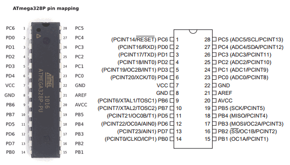
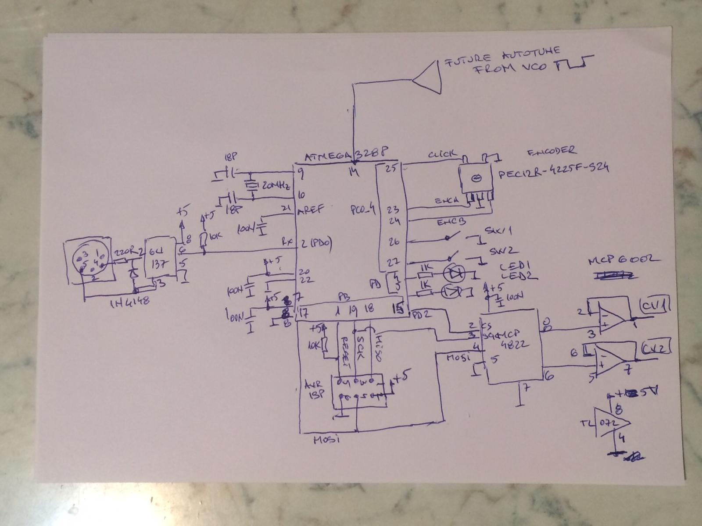

# Docs

## Hardware

### Atmega328P Pinout

### Pin Usage

| Pin  | Avr Pin | Usage                          |
| ---- | ------- | ------------------------------ |
| 1    | PC6     | ISP Reset                      |
| 2    | PD0     | Rx / Midi in                   |
| 3    | PD1     | Tx / Debugging / lcd digit2    |
| 4    | PD2     | Auto Tune In 1                 |
| 5    | PD3     | Auto Tune In 2                 |
| 6    | PD4     | lcd digit1                     |
| 7    | VCC     |                                |
| 8    | GND     |                                |
| 9    | PB6     | Osc                            |
| 10   | PB7     | Osc                            |
| 11   | PD5     | SR latch                       |
| 12   | PD6     | Gate                           |
| 13   | PD7     | Trigger                        |
| 14   | PB0     | SR clk                         |
| 15   | PB1     | SR data                        |
| 16   | PB2     | CS: DAC                        |
| 17   | PB3     | SPI MOSI: DAC / ISP            |
| 18   | PB4     | SPI MISO: ISP / ISP            |
| 19   | PB5     | SPI SCK: DAC / ISP             |
| 20   | AVCC    |                                |
| 21   | AREF    |                                |
| 22   | GND     |                                |
| 23   | PC0     | Encoder1                       |
| 24   | PC1     | Encoder2                       |
| 25   | PC2     | Encoder Button                 |
| 26   | PC3     | Mode Button                    |
| 27   | PC4     | Mode Led1                      |
| 28   | PC5     | Mode Led2                      |

### Datasheets

* Mpu Atmega328P: http://ww1.microchip.com/downloads/en/DeviceDoc/Atmel-7810-Automotive-Microcontrollers-ATmega328P_Datasheet.pdf
* Dac MCP4822E: http://ww1.microchip.com/downloads/en/devicedoc/20002249b.pdf
* OpAmp MCP6002: https://datasheet.octopart.com/MCP6002-I/SN-Microchip-datasheet-9909960.pdf
* Shift register 75HC595: https://www.onsemi.com/pub/Collateral/MC74HC595-D.PDF

### Schematic Notes

* 100nf Decoupling must be set very close to gnd and vcc legs of 75HC595

### Schematic

